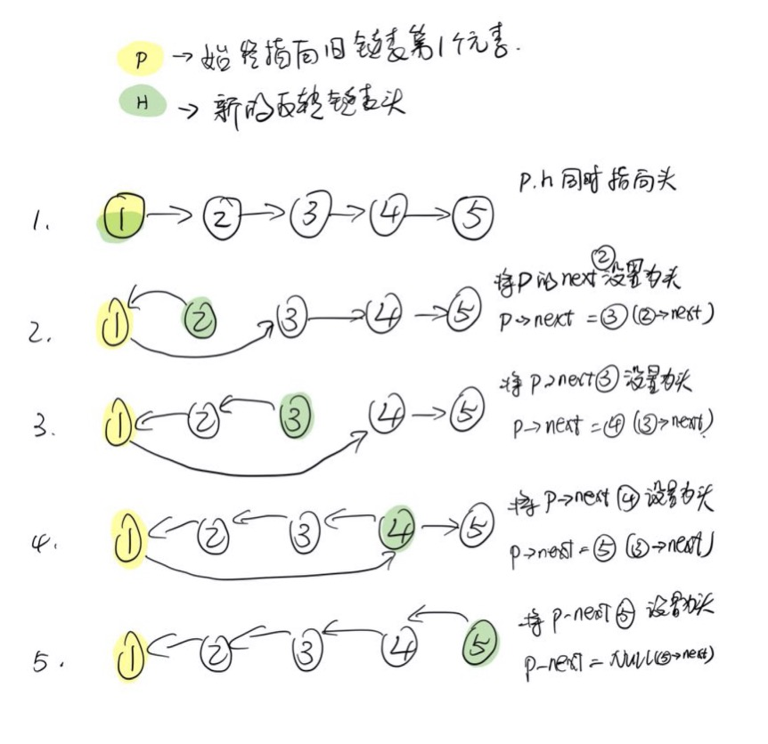

## 206. 反转链表
反转一个单链表。

示例:

```shell
输入: 1->2->3->4->5->NULL
输出: 5->4->3->2->1->NULL
```

进阶:
你可以迭代或递归地反转链表。你能否用两种方法解决这道题？

来源：力扣（LeetCode）
链接：https://leetcode-cn.com/problems/reverse-linked-list
著作权归领扣网络所有。商业转载请联系官方授权，非商业转载请注明出处。


### 解题方法1

1. 使用两个指针(head/ptr)指向链表的首节点
2. 循环处理将ptr指向的下一个节点放到链表起点然后重置链表头, 直到ptr指向的下一个节点没有子节点.

*特别的: ptr一直指向原始链表的链表头*

针对链表 `1-2-3-4-5`的操作步骤如下:


### 源码

```C
/**
 * Definition for singly-linked list.
 * struct ListNode {
 *     int val;
 *     struct ListNode *next;
 * };
 */

struct ListNode* reverseList(struct ListNode* head){
    if (head == NULL) { return NULL; }

    // 这里非常有意思的地方：
    // 后面的元素一直向前时, 原始的第一个node一直充当下一次操作的起点
    struct ListNode* ptr = head;
    struct ListNode *next;
    while (ptr->next != NULL) {
        next = ptr -> next;
        ptr -> next = next -> next;
        next -> next = head;
        head = next;
    }
    return head;
}
```

### 方法2(递归)

#### 思路
1. 尾节点, 则返回当前节点(新链表的起点)
2. 尾部双节点, 调换位置, 返回旧链表尾节点
3. 保证有三个有效节点(head - next - nextnext, ...), 递归`reverseList(next)`返回反转的子链表(..., nextnext),
3. 返回新链表起点

#### 总结
尝试过 head/ 其他递归这种方式, 产生的问题是需要遍历子链表才能得到最后一个元素导致效率低下。

记住head, next有助于代码的精简, 原理如下:

假设当前情况为: `3(head) - 4(next) - 5 ....`    
反转改变不了的事实是3必须在4的后面, 所以记住了next和head, 递归完子链表, 只需要将next->next = head即可.


```C
/**
 * Definition for singly-linked list.
 * struct ListNode {
 *     int val;
 *     struct ListNode *next;
 * };
 */

struct ListNode* reverseList(struct ListNode* head){
    if (head == NULL) { return NULL; }
    
    struct ListNode *next = head -> next;
    if (next == NULL) {
        return head;
    } else if (next -> next == NULL) {
        // 尾部双节点,交换位置, 返回原尾部
        // 4(head) - 5(next) - NULL(next->next)
        next -> next = head;
        head -> next = NULL;
        return next;
    } else {
        // 3(head) - 4(next) - 5
        // 连续多节点, 记住head/next的位置
        // 递归结束后, head变成next的子节点这个事实不会改变
        // head成为尾节点, head->next = NULL
        struct ListNode *temp = reverseList(next);
        // temp: 5 - 4(next)
        next -> next = head;
        head -> next = NULL;

        return temp;
    }
}
```